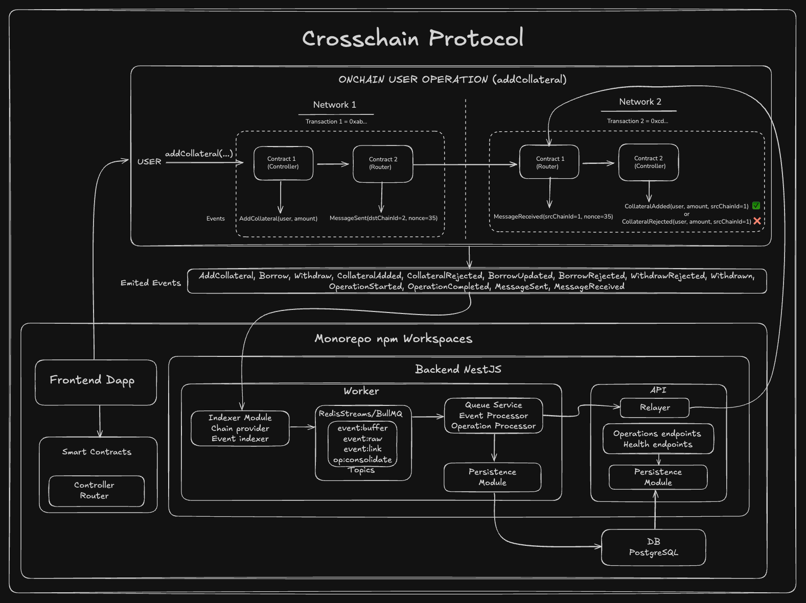

# Cross-Chain Lending Protocol - Rather Labs Challenge

A sophisticated cross-chain lending protocol built with smart contracts, blockchain event processing, and automated operation consolidation. This system enables users to add collateral, borrow, and withdraw across multiple blockchain networks with seamless cross-chain communication.

## 🏗️ Architecture

The system consists of four main components:

### 1. Smart Contracts (`packages/contracts/`)
- **Controller Contract**: Core lending logic with cross-chain operation support
- **Router Contract**: Cross-chain message routing and nonce management
<!-- - **Two-phase Operation Flow**: "init" phase for validation, "finish" phase for execution -->

### 2. Event Processing Worker (`apps/worker/`)
- **NestJS-based worker service** for blockchain event processing
- **Redis + BullMQ** for reliable job queuing and processing
- **PostgreSQL + Prisma** for data persistence and relationships
- **Multi-stage processing pipeline**: Raw events → Buffered events → Linked events → Consolidated operations

### 3. API Service (`apps/api/`)
- **RESTful API** for querying operations, messages, and transactions
- **Relayer** for finish and simulate crosschain operations
- **Real-time event data** with comprehensive filtering and pagination
- **Cross-chain operation status tracking**

### 4. Frontend DApp (`apps/web/`)
- **Web3 Integration** via Wagmi and Viem for blockchain interactions
- **MetaMask Support** for wallet connections and transaction signing
- **Real-time Updates** with Server-Sent Events (SSE) for operation status
- **Responsive UI** with Tailwind CSS and shadcn/ui components
- **Cross-chain Operations** interface for lending protocol interactions

### General Architecture diagram



## 🔄 Cross-Chain Operation Flow

### Phase 1: Initialization ("init" status = 0)
1. User calls Controller method (addCollateral/borrow/withdraw)
2. Controller validates parameters and emits operation events
3. Controller calls Router.sendMessage with encoded operation data
4. Router generates internal nonce and emits MessageSent event
5. Worker processes MessageSent event and stores message data

### Phase 2: Completion ("finish" status = 1)
1. Once the initial operation is consolidated, worker calls Relayer
2. Relayer calls Router.receiveMessage on target chain 
3. Router decodes message data and calls Controller with "finish" status
4. Controller completes operation and emits final events
5. Worker processes MessageReceived event and consolidates operation
6. Operation status updated to "completed" with message linkage

## 🛠️ Key Features

### Smart Contract Features
- **Status Flag System**: Two-phase operations with "init" and "finish" phases
- **Internal Nonce Generation**: Router manages nonces automatically
- **Cross-Contract Communication**: Clean separation between routing and business logic
- **Event-Driven Architecture**: Comprehensive event emission for all operations
- **Configurable Addresses**: Dynamic contract address configuration post-deployment

### Worker Service Features
- **Event Processing Pipeline**: Multi-stage processing with buffering and correlation
- **Operation Consolidation**: Automatic linking of cross-chain messages to operations
- **Message Correlation**: Intelligent matching of sent/received messages by nonce
- **Retry Mechanisms**: Automatic retry for stuck or failed operations
- **Timeout Handling**: Configurable timeouts for message processing
- **Relayer Integration**: Automated API calls to bridge services

### Frontend DApp Features
- **Wallet Integration**: MetaMask and other Web3 wallet support
- **Cross-chain Operations**: Intuitive interface for lending protocol interactions
- **Real-time Status**: Live updates of operation status via SSE
- **Transaction Management**: Sign and submit transactions with proper gas estimation
- **Network Switching**: Seamless switching between different blockchain networks
- **Responsive Design**: Mobile-first design with modern UI components
- **Operation History**: Complete view of user's cross-chain operations

### Data Management
- **Comprehensive Schema**: Full relational model for chains, contracts, transactions, events, messages, and operations
- **Real-time Processing**: Event-driven updates with immediate data consistency
- **Operation Lifecycle**: Complete tracking from initiation to completion
- **Message Tracking**: Full cross-chain message lifecycle with delivery confirmation

## 📊 Database Schema

### Core Entities
- **Chains**: Blockchain network configurations and status
- **Contracts**: Smart contract addresses and metadata
- **Transactions**: On-chain transaction records with confirmations
- **Events**: Blockchain event logs with structured parameters
- **Messages**: Cross-chain message tracking with nonces
- **Operations**: User operations with full lifecycle management

### Key Relationships
- Operations link to start/end transactions and messages
- Messages connect sent/received transactions across chains
- Events are associated with transactions and operations
- Full audit trail for all cross-chain activities

## 🚀 Technology Stack

### Frontend
- **Next.js 14**: React framework with App Router and server-side rendering
- **React 19**: Modern React with hooks and concurrent features
- **TypeScript**: Full type safety across the frontend
- **Tailwind CSS**: Utility-first CSS framework for rapid UI development
- **shadcn/ui**: High-quality, accessible React components
- **Wagmi**: React hooks for Ethereum
- **Viem**: TypeScript interface for Ethereum

### Backend
- **NestJS**: Modern Node.js framework with TypeScript
- **Prisma ORM**: Type-safe database access with migrations
- **PostgreSQL**: Relational database for complex queries
- **Redis**: In-memory data store for queue management
- **BullMQ**: Robust job queue processing

### Blockchain
- **Solidity ^0.8.19**: Smart contract development
- **Cross-chain Messaging**: Router-Controller architecture
- **Event-driven Design**: Comprehensive blockchain event handling

### Infrastructure
- **Docker**: Containerized deployment
- **TypeScript**: Full type safety across the stack
- **ESLint/Prettier**: Code quality and formatting
- **Turborepo**: Monorepo management

## 📂 Project Structure

```
rather-labs-challenge/
├── apps/
│   ├── api/               # REST API service
│   ├── worker/            # Event processing worker
│   └── web/               # Frontend DApp (Next.js)
├── packages/
│   ├── contracts/         # Smart contracts (Solidity)
│   ├── prisma/           # Database schema and migrations
│   └── shared-types/     # Shared TypeScript types
└── README.md
```

## 🎯 Operation Types

### AddCollateral
- **Purpose**: Add collateral to user's lending position
- **Validation**: Minimum collateral amount (1000 units)
- **Cross-chain**: Supports cross-chain collateral deposits
- **Events**: AddCollateral → CollateralAdded/CollateralRejected

### Borrow
- **Purpose**: Borrow against deposited collateral
- **Validation**: Sufficient collateral + LTV ratio checks
- **Cross-chain**: Borrow on different chain than collateral
- **Events**: Borrow → BorrowUpdated/BorrowRejected

### Withdraw
- **Purpose**: Withdraw collateral from lending position
- **Validation**: Sufficient balance + minimum collateral requirements
- **Cross-chain**: Withdraw to different chain
- **Events**: Withdraw → Withdrawn/WithdrawRejected

## 🔍 Event Processing Pipeline

### Stage 1: Raw Event Processing
- Blockchain events captured and stored immediately
- Transaction validation and storage
- Basic event structure validation

### Stage 2: Buffered Event Processing
- Event correlation and operation linking
- Confidence scoring for event relationships
- Operation state updates

### Stage 3: Event Linking
- Events linked to specific operations
- Operation consolidation triggers
- Cross-reference validation

### Stage 4: Operation Consolidation
- Final operation state determination
- Message correlation and completion
- Status updates and audit trail completion

## 🏃‍♂️ Getting Started

### Prerequisites
- Node.js 18+
- Docker & Docker Compose
- PostgreSQL 14+
- Redis 6+

### Installation
1. Clone the repository
2. Install dependencies: `pnpm install`
3. Set up environment variables
4. Run database migrations: `pnpm prisma migrate dev`
5. Start services: `docker-compose up -d`
6. Deploy smart contracts
7. Start the worker: `pnpm run start:worker`
8. Start the API: `pnpm run start:api`

### Configuration
- Configure chain RPC URLs in the database
- Set contract addresses using setter methods
- Configure relayer API endpoints
- Set up event monitoring for target chains


## 🔐 Security Features

- **Input Validation**: Comprehensive parameter validation in smart contracts
- **Reentrancy Protection**: Safe contract interactions
- **Access Controls**: Proper authorization for sensitive operations
- **Error Handling**: Graceful failure modes and recovery
- **Audit Trail**: Complete transaction and operation history

## 🌐 Cross-Chain Support

The protocol is designed for multi-chain deployment with:
- **Chain Abstraction**: Generic blockchain interaction layer
- **Message Standardization**: Consistent cross-chain message format
- **Nonce Management**: Reliable message ordering and deduplication
- **Bridge Integration**: Compatible with existing bridge protocols
- **Event Synchronization**: Cross-chain event correlation and processing

---

This cross-chain lending protocol demonstrates advanced blockchain architecture with sophisticated event processing, reliable cross-chain communication, and comprehensive operation lifecycle management.